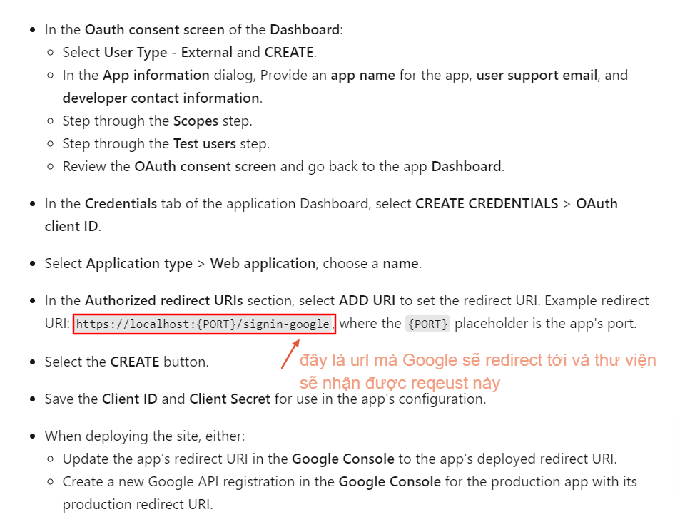
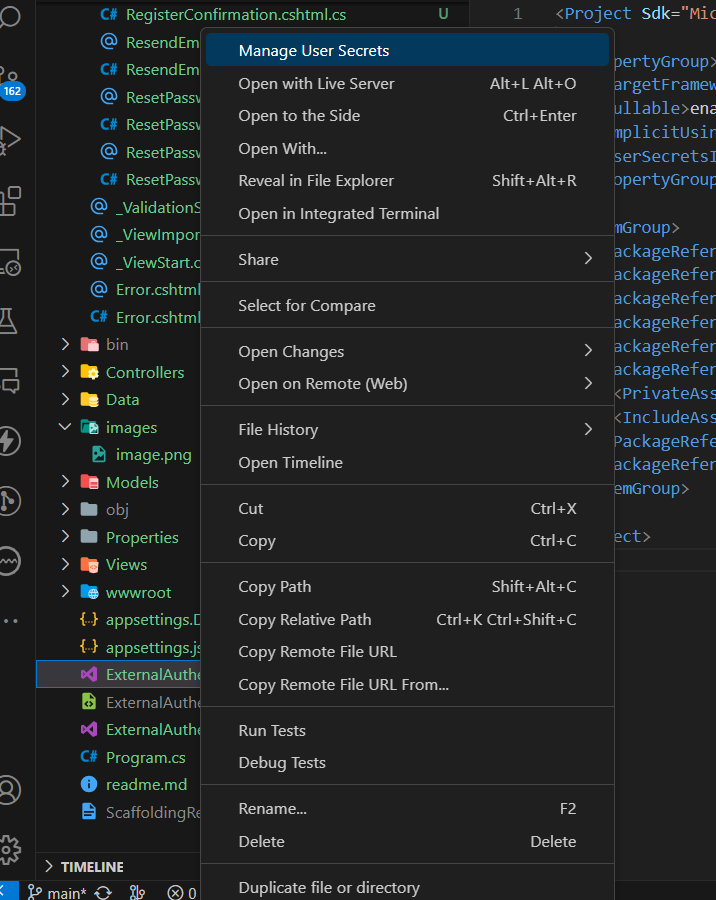
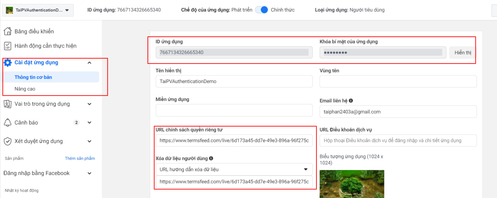
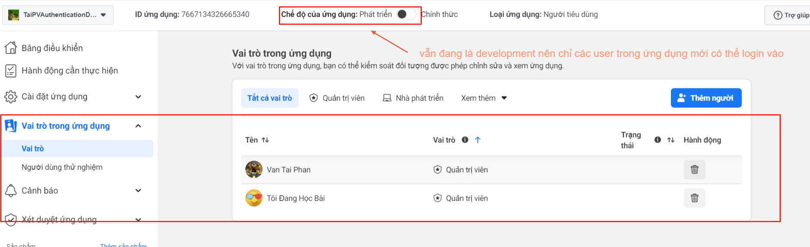

### 1. Google Authentication
- Project này cần quan tâm các file: ExternalLogin.cshtml.cs, tại đây sẽ chứa cách vận hành của google authentication

mà quan trọng nhất là đoạn code sau:
```csharp
public IActionResult OnPost(string provider, string returnUrl = null)
        {
            // Sau khi login xong thì sẽ gọi đến hàm OnGetCallbackAsync của ExternalLogin.cshtml.cs
            var redirectUrl = Url.Page("./ExternalLogin", pageHandler: "Callback", values: new { returnUrl });

            // redirectUrl sẽ được thư viện IdentityServer4 sử dụng để chuyển hướng sau khi login xong
            // Còn với External authentication sẽ không sử dụng redirectUrl này mà dùng https://{port}/signin-{provider}
            // Ví dụ với Google thì sẽ là https://{port}/signin-google, do đó cần cấu hình Google console có
            // authorized redirect url là https://{port}/signin-google
            var properties = _signInManager.ConfigureExternalAuthenticationProperties(provider, redirectUrl);

            // Dùng để chuyển hướng đến trang login của provider
            return new ChallengeResult(provider, properties);
        }
```

- Có thể lưu ClientId, ClientSecret vào secret manager nhưng làm như vậy sẽ chỉ có thể chạy trên máy local
Nếu lưu vào thư mục secret thì sẽ chỉ có thể dùng cho môi trường local
 

### 2. Facebook authentication:
- Chỉ cần thay đổi 1 chút so với google authentication là có thể sử dụng được facebook authentication. Cụ thể là trong file Program.cs như sau:
```csharp
builder.Services.AddAuthentication(options =>
    {
        options.DefaultScheme = FacebookDefaults.AuthenticationScheme;
    })
    .AddGoogle(googleOptions =>
    {
        googleOptions.ClientId = configuration["Authentication:Google:ClientId"];
        googleOptions.ClientSecret = configuration["Authentication:Google:ClientSecret"];
    })
    .AddFacebook(facebookOptions =>
    {
        facebookOptions.AppId = configuration["Authentication:Facebook:ClientId"];
        facebookOptions.AppSecret = configuration["Authentication:Facebook:ClientSecret"];
    });
```
- Truy cập vào url: https://developers.facebook.com/apps/7667134326665340/add/, thực hiện đăng nhập facebook rồi tạo 1 tài khoản,
xem youtube: 

- Khi được Facebook yêu cầu 1 privacy policy URL thì có thể sử dụng https://app.termsfeed.com/wizard/privacy-policy để tạo ra 1 privacy policy, copy url này vào 2 ô (chính sách quyền riêng tư và xoá dữ liệu người dùng). Tuy nhiên do đang làm local nên tại mục địa chi trang web nên không thể publish được ứng dụng nên lúc đăng nhập bằng facebook trong ứng dụng web ASP.NET Core thì chỉ có tài khoản quản trị thuộc phạm vi của ứng dụng mới có thể dùng được, còn tài khoản khác sẽ không thể đăng nhập được. Giả sử add thêm 1 tài khoản khác vào
 Thì lúc này ta đã `có thể đăng nhập bằng Facebook bởi 2 tài khoản rồi`. Sau này khi publish ứng dụng thì sẽ không cần phải thêm tài khoản vào nữa
mà chỉ `cần đặt lại địa chỉ trang web` là 1 url public rồi publish lại ứng dụng thì sẽ có thể đăng nhập bằng bất kỳ tài khoản nào trên facebook.

