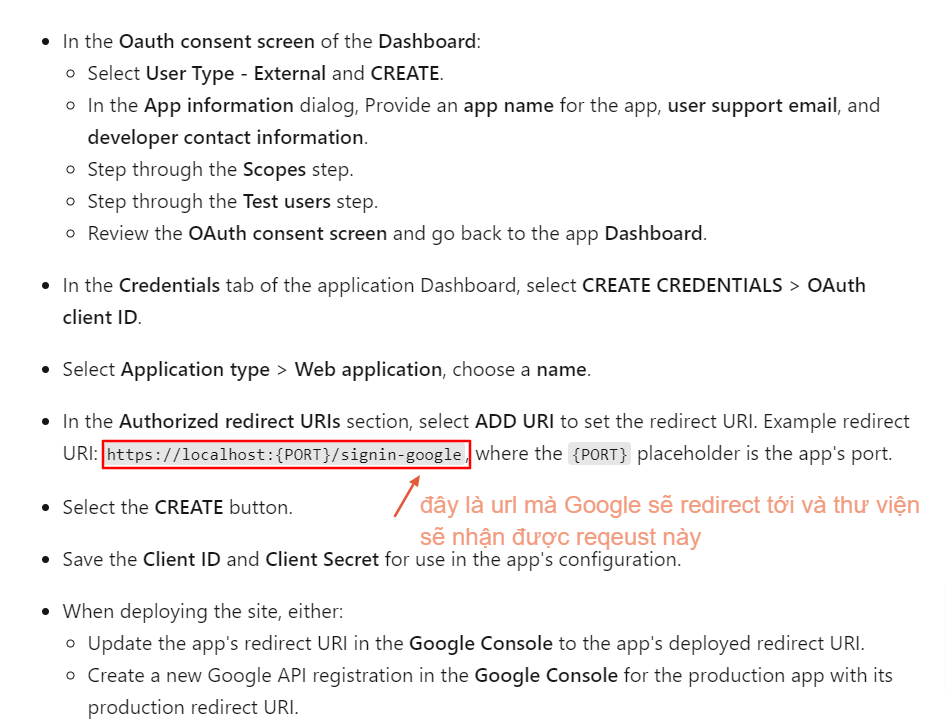
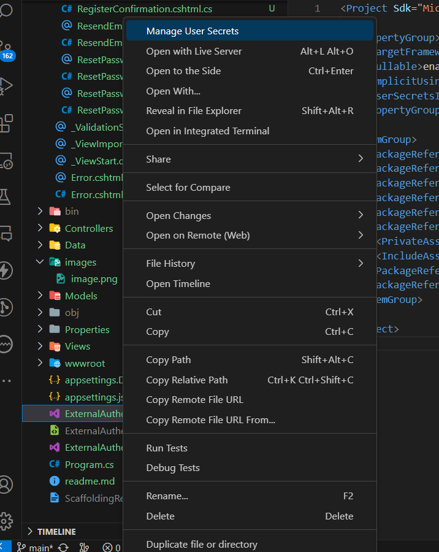

- Project này cần quan tâm các file: ExternalLogin.cshtml.cs, tại đây sẽ chứa cách vận hành của google authentication

mà quan trọng nhất là đoạn code sau:
```csharp
public IActionResult OnPost(string provider, string returnUrl = null)
        {
            // Sau khi login xong thì sẽ gọi đến hàm OnGetCallbackAsync của ExternalLogin.cshtml.cs
            var redirectUrl = Url.Page("./ExternalLogin", pageHandler: "Callback", values: new { returnUrl });

            // redirectUrl sẽ được thư viện IdentityServer4 sử dụng để chuyển hướng sau khi login xong
            // Còn với External authentication sẽ không sử dụng redirectUrl này mà dùng https://{port}/signin-{provider}
            // Ví dụ với Google thì sẽ là https://{port}/signin-google, do đó cần cấu hình Google console có
            // authorized redirect url là https://{port}/signin-google
            var properties = _signInManager.ConfigureExternalAuthenticationProperties(provider, redirectUrl);

            // Dùng để chuyển hướng đến trang login của provider
            return new ChallengeResult(provider, properties);
        }
```

- Có thể lưu ClientId, ClientSecret vào secret manager nhưng làm như vậy sẽ chỉ có thể chạy trên máy local
Nếu lưu vào thư mục secret thì sẽ chỉ có thể dùng cho môi trường local
 
